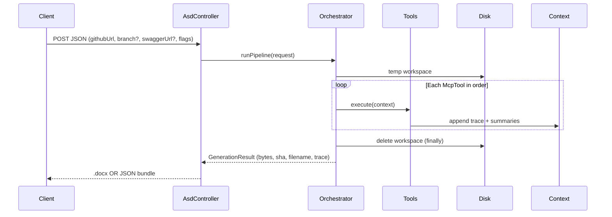
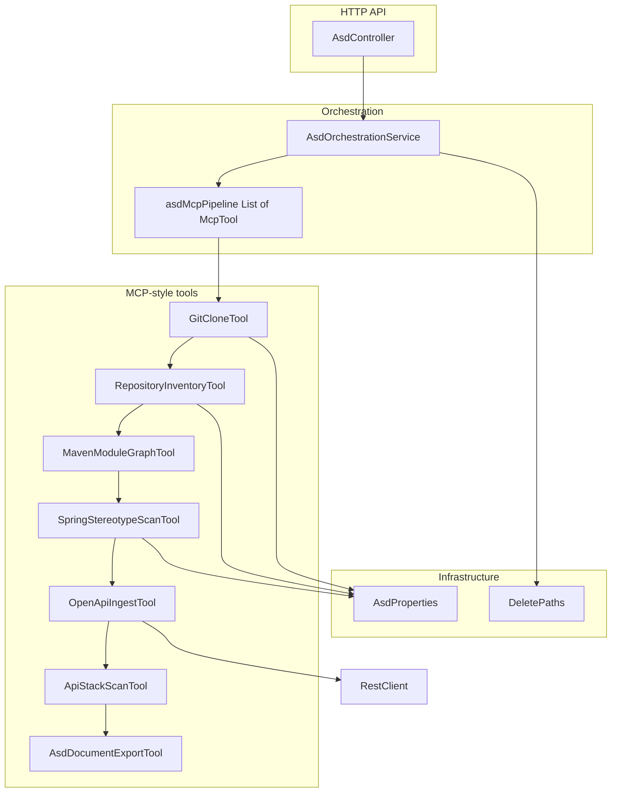

# ASD Architecture Service — Design Document

This document explains **what the service does**, **how the pieces fit together**, and **how to demo** it. It matches the implementation in `asd-architecture-service`.

---

## 1. Purpose

Generate an **Architecture Specification Document (ASD)** from a remote **Git** repository (typically GitHub), using a **fixed pipeline of analysis steps** exposed as **MCP-style tools** (Java interfaces), and deliver the result as **Microsoft Word `.docx`** or **PDF** with structured headings, tables, diagrams, and monospace technical blocks.

Two consumption modes:

| Mode | Endpoint | Response | Best for |
|------|-----------|----------|----------|
| **File download** | `POST /api/v1/asd/generate` | Raw `.docx` bytes | Postman, curl, browser download |
| **Swagger demo** | `POST /api/v1/asd/generate/bundle` | JSON + Base64 document + tool trace | Swagger UI “Try it out” |

---

## 2. Your mental model (REST vs MCP)

- **Swagger / OpenAPI** documents the **REST API** (`/v3/api-docs`, `/swagger-ui.html`).
- **MCP (Model Context Protocol)** here is implemented as a **design pattern**: discrete **tools** (`McpTool`) invoked in order by an **orchestrator** inside the **same JVM**. There is **no separate MCP daemon** in this baseline; you can add a wire-protocol MCP server later that delegates to the same Spring beans.
- **Flow:** HTTP request → `AsdController` → `AsdOrchestrationService.runPipeline` → tools mutate shared `McpToolContext` → final tool writes **DOCX bytes** → temp clone directory deleted in `finally`.



---

## 3. Component diagram



---

## 4. Tool contracts

### 4.1 `McpTool`

- `name()` — stable identifier (e.g. `git_clone`) used in traces.
- `description()` — human-readable summary for docs / future MCP exposure.
- `execute(McpToolContext ctx)` — reads prior state from `ctx`, writes new state, calls `ctx.trace(...)`.

### 4.2 `McpToolContext`

Mutable **pipeline context**:

| Field | Produced by | Used by |
|--------|-------------|----------|
| `workspaceDir` | `GitCloneTool` | Cleanup |
| `repositoryRoot` | `GitCloneTool` | All scanners |
| `commitSha` | `GitCloneTool` | ASD title table |
| `inventorySummary` | `RepositoryInventoryTool` | ASD §3–3.4 (tabular + workspace paths + appendix JSON); uses `RepoTreeWalker` (skips `node_modules`, `target`, …) |
| `mavenSummary` | `MavenModuleGraphTool` | ASD §4 |
| `springSummary` | `SpringStereotypeScanTool` | ASD §5 |
| `sqlScriptSummary` | `SqlScriptAnalysisTool` | ASD §7 (tabular + appendix JSON) |
| `sqlErModel` | `SqlScriptAnalysisTool` | ER PNG in §7 when DDL infers tables |
| `openApiJson` | `OpenApiIngestTool` | ASD §6 (metadata, REST op table, excerpt) |
| `apiSurfaceSummary` | `ApiStackScanTool` | ASD §6 — Spring Boot vs Node, REST vs GraphQL, OpenAPI op list |
| `documentBytes` | `AsdDocumentExportTool` | HTTP response (DOCX or PDF) |

**Trace:** ordered list of `{tool, status, detail}` returned on **`/generate/bundle`**. Appendix A of the export renders this as a table (DOCX) or monospace lines (PDF).

**ASD layout:** `AsdNarrative` + `DocxAsdBuilder` / `PdfAsdBuilder` produce a presentation-style report: document control, executive summary, findings as **tables** (not raw JSON in the body), diagrams, RAG-style quality/security rows, then appendices (trace + truncated JSON).

---

## 5. Tool-by-tool behavior

| Tool | Technology | Output |
|------|-------------|--------|
| **git_clone** | JGit shallow clone | Files on disk; `commitSha` |
| **repo_inventory** | `RepoTreeWalker` (capped regular files) | Extension + polyglot histograms; **all** sampled `package.json` / `pom.xml` paths; `angular.json` / `nx.json` counts; `ANGULAR_TYPESCRIPT` bucket |
| **maven_module_graph** | `MavenXpp3Reader` | Primary `pom.xml` (root or first from inventory) + **sample child POMs** → merged dependency artifact list |
| **spring_stereotype_scan** | Line scan of `.java` | Counts of `@RestController`, `@Service`, etc. (heuristic, not a full AST) |
| **sql_script_analysis** | `Files.walk` + line heuristics | `.sql` inventory, DDL/DML mix, inferred ER model |
| **openapi_ingest** | `RestClient` GET | Optional OpenAPI JSON from a **running** `swaggerUrl` |
| **api_stack_scan** | Inventory `package.json` paths + `pom` + `RepoTreeWalker` + OpenAPI | Polyglot profile (**`FULL_STACK_JAVA_ANGULAR`** when Spring + Angular signals), REST vs GraphQL, Angular **HttpClient** / **environment URL** hints, REST op table |
| **asd_document_export** | Apache POI / PDFBox + Java2D PNG | Final **DOCX** or **PDF** bytes; architecture flowchart + optional ER diagram |

**Limitations (honest for interviews):**

- Root POM only for Maven graph; multi-module child POMs are not all merged.
- Spring scan is **textual**, not JavaParser-level semantics.
- OpenAPI in the document is **truncated**; the **REST operation table** lists path + method from `paths` but may omit vendor extensions.
- **GraphQL** is inferred from dependencies and schema-like files, not from executing a GraphQL introspection query.
- Mermaid in Word is **plain text** (Word does not render Mermaid natively).
- **ER diagrams** are rendered as **PNG** (Java2D) from heuristics over `.sql` files (`CREATE TABLE`, `REFERENCES`, `ALTER TABLE … FOREIGN KEY … REFERENCES`), not from Mermaid.

---

## 6. Configuration

`application.properties`:

| Key | Meaning |
|-----|---------|
| `asd.clone-depth` | Shallow clone depth (default `1`) |
| `asd.scan-max-files` | Max nodes / Java files walked per scan |
| `server.port` | Default `8015` |

---

## 7. Security & operations notes

- Only **http(s)** Git and Swagger URLs are accepted in tools (see `GitCloneTool` / `OpenApiIngestTool`).
- Clones go under **system temp**; deleted in `finally` after pipeline completes.
- For production: add **auth** on endpoints, **rate limits**, **disk quotas**, **allowlist** of Git hosts, and run clones in **sandboxed workers**.

---

## 8. Extension roadmap

1. **JavaParser** (or similar) for accurate type / import graphs.
2. **`mvn dependency:tree`** in an isolated container for full dependency graphs.
3. **LLM enrichment** (e.g. Gemini) with **JSON-only** inputs = tool outputs; require citations.
4. **Wire-protocol MCP server** (Spring AI MCP or `io.modelcontextprotocol`) exposing the same tools to Cursor/Claude without REST.

---

## 9. Demo checklist

1. `mvn spring-boot:run` from `asd-architecture-service`.
2. Open Swagger: `http://localhost:8015/swagger-ui.html`.
3. Call **`POST /api/v1/asd/generate/bundle`** with a small public repo JSON body; copy `documentWordBase64`, decode to `.docx`, open in Word.
4. Call **`POST /api/v1/asd/generate`** with Postman → **Send and Download** to get the file directly.

Example body:

```json
{
  "githubUrl": "https://github.com/spring-projects/spring-petclinic.git",
  "branch": "main",
  "swaggerUrl": null,
  "includeLlmPlaceholderSection": true
}
```

---

## 10. Glossary

| Term | Meaning |
|------|---------|
| **ASD** | Architecture Specification Document produced by this service. |
| **MCP-style tool** | A composable pipeline step with a clear name + trace; same spirit as MCP tools, in-process. |
| **Orchestrator** | `AsdOrchestrationService` — runs tools in order, owns lifecycle of temp workspace. |
